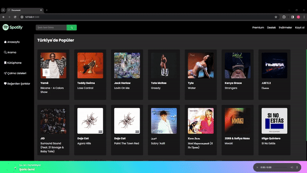

<h1>SPOTİFY-CLONE</h1>

This project comprises a Spotify clone developed using JavaScript and SCSS, integrating data from an external API. The clone offers users fundamental Spotify functionalities, including music searching, playback, and playlist viewing.

<h2>Features</h2>

<ul>
        <li>Developed using JavaScript to create a modular application structure.</li>
        <li>Real-time music data is fetched by integrating an external API.</li>
        <li>SCSS is utilized for CSS to ensure modularity and easier styling management.</li>
        <li>Responsive design provides a seamless experience across various screen sizes.</li>
        <li>Different animations are used.</li>
</ul>

<h2>Screen Gif</h2>

